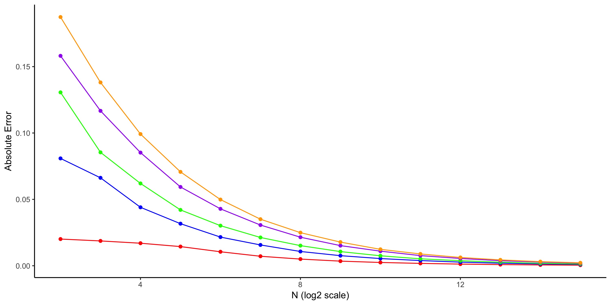
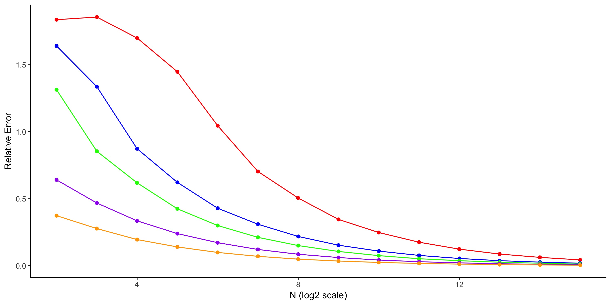

#Part I. Backgroud
  It was the beginning of school year, Rina was so excited that she  finally started her college life. At her first day of school, she kneely noticed that there were only a few girls in her class, much less than the 49% claimed on school's website. Being skeptical of the number's validity, Rina decided to follow the instruction from her AP Stats textbook and calculate the rate by herself. 
  
  However, Rina soon ran into a problem, as she was unable to decide how many students she should include in her sample, and she wonders __how the sample size affects the accuracy of her calculation result__. So Rina first looked up some measurements of "errors" in statistics: __absolute error__ and __relative error__.

***
# Part II. Definition
### Absolute Error
> The difference between the measured or inferred value of a quantity $x_0$ and its actual value $x$, given by $$\Delta x =x_{0}-x$$ (sometimes with the absolute value taken) is called the _absolute error_.

### Relative Error
> Let the true value of a quantity be $x$ and the measured or inferred value $x_0$. Then the _relative error_ is defined by $$\delta x= \frac{\Delta x}{x}=\frac{x_0-x}{x}=\frac{x_0}{x} -1$$ where $\Delta x$ is the absolute error.

***
#Part III. Simulation
  Tired of the mathematical theories behind the comcepts, Rina decided to seek help from her sister, who was working towards her master's degree in data  science. 
  
  Her sister assumed that the accuracy would be affected by both the __p (the true underlying probability)__ and __N (number of students in the sample)__. After she ran her program at different p and R, here is what she got:
  
 

 

## Reading the Graph
Rina recieved a note from her sister, explaining how to read the graph:

1. __Points__: each point in the graph is the percentage averaged over 10K times simulation.

2. __X-axis__: the number of students included in the sample, scaled by log10. e.g., 4 in the graph is actually 2^4 = 16 students in the sample.

3. __Lines__: each line represents a different p (the true underlying probability)

#Part IV.  Analysis of the Simulation
  After scrutinizing throught the two graphs, Rina came to a few conclusions:
 
### Absolute Error
1.  Generally speaking, the smaller p (the true underlying probability) is, the samller the absolute error is.

2. As N (sample size) increases, the absolute error converges to 0. So it is safe to assume that if the sample size is large enough, the probability observed would be very close to the true underlying probability.

### Relative Error
1.  On the contrary, the smaller p (the true underlying probability) is, the larger the absolute error would be. This can be explained by the p in the denominator of relative error's formula. The smaller the denominator is, the larger the result is.

2. Similarly, as N (sample size) increases, the relative error converges to 0. Again, we came to the conclusion that if the sample size is large enough, the probability observed would be very close to the true underlying probability.

***
# Part V. Limitations and Uncertainties
  Though Rina now understands that the bigger the sample size, the better the estimation will be, she still doesn't know the exact number of students she should include in her sample. Also, she has very limiting power in collecting the data.

  Another concern is that all the simulations are based on the assumption that her sampling is not biased, which could be hard to achieve in reality. No matter what  method she chooses, it's likely bias would be introduced. For example, if she did the sampling in her class,  the class population would not be a good representation of the whole population. So Rina might need some extra work to select her sample and make sure to the data she gets would be as representative as possible.