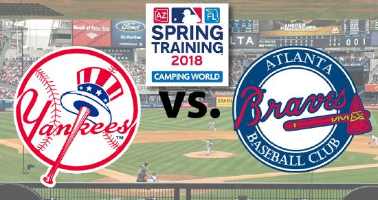

***
# I. Setup
<center>
{width=750px}
</center>

  The World Series is the annual championship series of Major League Baseball (MLB) in North America. The winner is determined through __a best-of-seven playoff__, where one team must win four games to win the series. If a series is won before all seven games have been played, all remaining games are omitted. It is not necessary for the four games to be won consecutively. Draws are not permitted, so a series will never require more than seven games.

  In this post, we want to examine how often does the team with a larger winning chance for a single game can win the series. Let's take a look at an contest between Braves and Yankees, __assuming Braves has a slightly higher winning rate for a single game__.
  
  Symbol|Meaning
  ------|-------
  $P_b$ | the probability that the Braves win __a single game__
  $P_y$ = 1 - $P_b$ | the probability that the Yankees win __a single game__

***
# II. Can Braves win the series ...

## 1. When $P_b$ = 0.55?
Let's assume $P_b$ = 0.55, and calculate probability that the Braves win the World Series.

```{r}
1 - pbinom(3,7,0.55)
```

> $P$(Braves win 4 out of 7 games)
= $1 - P$(Braves win less than 4 out of 7 games)
= $1 - 0.3917$
= $60.82$%

### What if $P_b$ changes?
```{r}
P_b <- seq(0.5, 1, by = 0.05)
P_Bwins_x <- rep(NA, 11)
for(i in 1:11){
  P_Bwins_x[i] <- 1 - pbinom(3, 7, P_b[i])
}
```

```{r}
library(ggplot2)

df_Bwin = data.frame(cbind(P_b, P_Bwins_x))
ggplot(df_Bwin, aes(x = P_b, y = P_Bwins_x)) + 
  geom_point(col = "#003399")+
  geom_line(col = "#003399") +
  scale_x_continuous(breaks = P_b) +
  theme_classic()+
  labs(x = "Probability that the Braves win a single game", y = "Probability that Braves win the World Series", title = "Probability that Braves win the World Series")
```

As $P_b$ becomes larger, the probability that Braves will ultimately win the World Series becomes closer and closer to 1, which makes sense as the probability of winning 4 games increases with the probability of winning a single game. When $P_b$ is larger than 0.9, it's almost for sure that Braves would win the series!

## 2. When it's not best-of-7?

What if MLB wants to change the winning rule to best-of-x? For example, if it's best-of-9, then Braves would have to win 5 games.

Assume the probability of Braves winning a single game is still 0.55, we want to determine what x (__the smallest series length__) is when Braves' probability of winning the World Series is larger than 80%.

```{r}
series_length <- seq(1, 1000, by = 2)

shortest_series_length <- function(p){
  for(x in series_length){
    p_wins <- 1 - pbinom(floor(x/2), x, p)
    if(p_wins >= 0.8){
      return(x)
    }
  }
  print("larger series length needed")
}
shortest_series_length(0.55)
```

To do this, we first assume there's only 1 game in the series, and check to see if Braves' probability of winning the World Series is larger than 80%. If not, then we increase the number to 3, 5, 7, etc. until we get to the 80%. Notice that the number has to be odd or there can be a draw.

The result is __71__. A quite large number! It's ten times the current series length!

### What if $P_b$ changes?
```{r}
P_b <- seq(0.55, 1, by = 0.05)
shortest <- rep(NA, 10)
for(i in 1:10){
  shortest[i] <- shortest_series_length(P_b[i])
}
shortest
```

```{r}
df_shortest = data.frame(cbind(P_b, shortest))
ggplot(df_shortest, aes(x = P_b, y = shortest)) + 
  geom_point(col = "#003399")+
  geom_line(col = "#003399")+
  scale_x_continuous(breaks = P_b) +
  theme_classic()+
  labs(x = "Probability of the Braves winning a head-to-head matchup", y = "Series length", title = "Shortest series so that the probability Braves wins WS ≥ 0.8")
```

As Braves' probability of winning a single game get's larger, the series length decrease. This is exactly we expected! When Braves gets better at playing the game, they will need less games in the series to win.

The decreasing slope is very steep. When $P_b$ = 0.7, Braves only need 5 games in the series; $P_b$ = 0.75, they need 3. If $P_b$ is larger than or equal to 0.8, then for a single game, they have at least 80% chance of winning (one game and that's all). They can win the World Series in just one game!

***
# III. Win at home or on road?

Since now, we haven't considered the difference of probability that Braves win a single game at home and on road. __Suppose that 50% of the games are at home, with $P_b$ = 0.55 and the other times, the games are on road, with $P_b$ = 0.45__.

What's the probability that $P_b$ = 0.55 given Braves wins World Series in exactly 7 games? 

First, we want to know the probability of Braves winning World Series in exactly 7 games with probability $p$. We use __negative binomial random variable__.

> $P$(Braves wins 3 out of the first 6 games) * $p$ (winning the last game) 
>
> = $6 \choose 3$*$p^3$*$(1-p)^3$*$p$

Then we use __Bayes' Rule__:

> $P(A_i | B)$ = $\frac{P(B|A_i)*P(A_i)}{(P(B|A_i)*P(A_i) + P(B|A_j)*P(A_j))}$

Symbol|Event|Assumption
------|------|---------
$B$   | Braves win World Series in exactly 7 games|
$A_i$ | $P_b$ = 0.55|$P(A_i)$ = 0.5
$A_j$ | $P_b$ = 0.45|$P(A_j)$ = 0.5

```{r}
# p: p(B wins a single game)
neg_binom <- function(p){
  dbinom(3,6,p)*p
}

#Calculate P(A|B) by bayes rules
#Assume A can be seperated into event a1 and a2
#prameter
#a1: p(B|a1), a2: p(B|a2), p: p(a1) 

bayes <- function(a1, a2, p){
  (a1*p)/(a1*p+a2*(1-p))
}
```

```{r}
p_a1 <- neg_binom(0.55)
p_a2 <- neg_binom(0.45)

bayes(p_a1, p_a2, 0.5)
```
$P$($P_b$ = 0.55|Braves win World Series in 7 games) = __0.55__

***
# IV. Uncertainties
  In this whole post, we assumed that $P_b$ is constant, this is far from the truth. In reality, anything from the weather to the performance of a single player can have a unpredictable effect on $P_b$. Also, $P_b$ may change over time, maybe changing with every game played. All of that changes were not included, here is just a really simple prediction model.