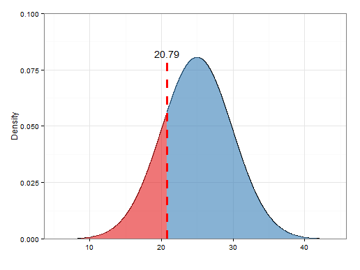
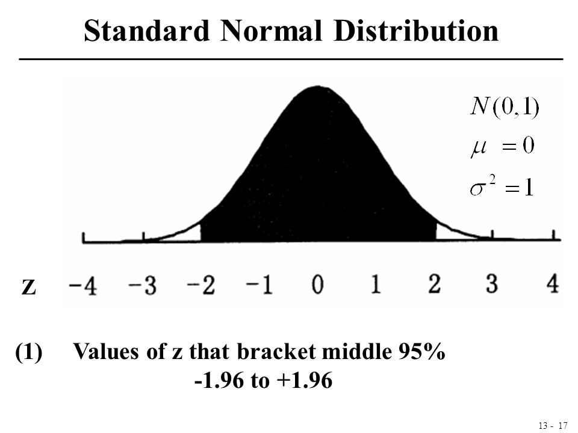

```{r setup, include=FALSE}
knitr::opts_chunk$set(echo = TRUE)
```

***
# I. Introduction

Given a data set, median is one of the most commonly used measure of the properties. It represents the middle value of the data distribution. Estimates of the median, however, have a degree of uncertainty because (a) the estimates are calculated from a finite sample and (b) the data distribution of the underlying data is generally unknown.

However, is the estimation of 0.2 quantile as precise as the estimation of median (0.5 quantile)? If not, which quantiles of a continuous distribution can one estimate with more precision?

> __0.2 quantile?__
>
><center>
>{width=450px}
></center>
>
>0.2 quantile (=20th percentile) is the red area to the contains the lower 20% of the data, which is 20.79 in this graph.

***
# II. Setup

In this blog post, we will examine four kinds of distribution: standard normal distribution, exponential distribution, and two mixtures of distribution. 

For each distribution, we generate N (5000) samples; for each sample, we calculate the quantile points (0.05 to 0.95); for each quantile, we measure how spread the sample quantiles are using the length of the middle 95% data. We want to learn how the length is related to quantile and density by making plots.

For example, in standard normal distribution, the __length of the middle 95%__ data points are about 2 standard deviation.

{width=300px}

Here are the definitions of probability density function and cumulative distribution function (which is closely related to quantiles) from Wikipedia.

>__Probability density function (PDF)__
>
> Probability density function (PDF) is a function whose value at any given sample (or point) in the sample space (the set of possible values taken by the random variable) can be interpreted as providing a relative likelihood that the value of the random variable would equal that sample.


> __Cumulative distribution function (CDF)__
>
> Cumulative distribution function of a real-valued random variable $X$ evaluated at $x$ is the probability that $X$ will take a value less than or equal to $x$. In the case of a scalar continuous distribution, it gives the area under the probability density function from minus infinity to $x$. 

***
# III. Standard normal distribution

## Quantile
```{r}
# for Distribution 1: normal distribution
N_simulation <- 5000   # Simulation size N
N = 200      # sample size
col = 19      # number of columns in the matrix
qtl <- seq(0.05, 0.95, 0.05)
d1_qtl_matrix <- matrix(ncol = col)         # matrix to store quantiles of size N_sim * col

for(i in 1:N_simulation){
  # generate a random sample of size N
  s <- rnorm(N, mean = 0, sd = 1)
  dis <- quantile(s, probs = seq(0.05, 0.95, 0.05))
  d1_qtl_matrix <- rbind(d1_qtl_matrix, dis)
}

# calculate the length of the middle 95%
d1_qtl_length <- rep(NA, col)

for(i in seq(d1_qtl_length)){
  q <- quantile(d1_qtl_matrix[,i], probs = c(0.025, 0.975), na.rm = TRUE)
  d1_qtl_length[i] <- q[[2]] - q[[1]]
  }
```

```{r}
# plot
library(ggplot2)
ggplot(data.frame(d1_qtl_length), aes(x = seq(0.05, 0.95, 0.05), y = d1_qtl_length)) +
  geom_point()+
  geom_line()+
  scale_x_continuous(limits = c(0.05,0.95), breaks = qtl, labels = qtl)+
  labs(title = "Length of middle 95% of sampling distance", x = "p quantile", y = "Length")+
  theme_classic()
```

We can see from the graph that the closer to median, the less spread the simulations are. For normal distribution, estimating median is indeed more precise than estimating other quantiles. 

## Density

```{r}
x <- qnorm(qtl, mean = 0, sd = 1)
d1_dens_x <- dnorm(x, mean = 0, sd = 1)
```

```{r}
d1_dens_matrix <- data.frame(cbind(d1_dens_x, d1_qtl_length))

ggplot(d1_dens_matrix, aes(d1_dens_x, d1_qtl_length))+
  geom_point()+
  geom_line()+
  scale_x_continuous(breaks = waiver(), labels = waiver())+
  labs(title = "Length of middle 95% by density", x = "Density", y = "Length")+
  theme_classic()
```

Since normal distribution model is symmetric, $-x$ and $x$ will have the same density. So, for each density point, there are two y values. However, we can still see the decreasing trend, meaning that the estimation is less precise when estimating the quantiles at the tails.

***
# IV. Exponential distribution

In this section, we examine the exponential distribution with rate 1. Here is a histogram of a exponential distribution with 200 samples.
```{r}
s <- rexp(200, rate = 1)
hist(s, breaks = 50)
```

## Quantile
```{r}
# Distribution 2: exponential distribution
N_simulation <- 5000   # Simulation size N
N = 200      # sample size
col = 19      # number of columns in the matrix
d2_qtl_matrix <- matrix(ncol = col)         # matrix to store quantiles of size N_sim * col

for(i in 1:N_simulation){
  # generate a random sample of size N
  s <- rexp(N, rate = 1)
  dis <- quantile(s, probs = seq(0.05, 0.95, 0.05))
  d2_qtl_matrix <- rbind(d2_qtl_matrix, dis)
}

# calculate the length of the middle 95%
d2_qtl_length <- rep(NA, col)

for(i in seq(d2_qtl_length)){
  q <- quantile(d2_qtl_matrix[,i], probs = c(0.025, 0.975), na.rm = TRUE)
  d2_qtl_length[i] <- q[[2]] - q[[1]]
  }
```

```{r}
# plot
ggplot(data.frame(d2_qtl_length), aes(x = seq(0.05, 0.95, 0.05), y = d2_qtl_length)) +
  geom_point()+
  geom_line()+
  scale_x_continuous(limits = c(0.05,0.95), breaks = qtl, labels = qtl)+
  labs(title = "Length of middle 95% of sampling distance", x = "p quantile", y = "Length")+
  theme_classic()
```

We can see that the larger the quantile, the less precise the estimation will be.

## Density

```{r}
qtl <- seq(0.05, 0.95, 0.05)
x <- qexp(qtl, rate = 1)
d2_dens_x <- dexp(x, rate = 1)
```

```{r}
d2_dens_matrix <- data.frame(cbind(d2_dens_x, d2_qtl_length))

ggplot(d2_dens_matrix, aes(d2_dens_x, d2_qtl_length))+
  geom_point()+
  geom_line()+
  scale_x_continuous(breaks = waiver(), labels = waiver())+
  labs(title = "Length of middle 95% by density", x = "Density", y = "Length")+
  theme_classic()
```

Similar to the case in normal distribution, the larger the density, the more precise the estimation is.

***
# V. Mixture distribution (1)

Use the following mixture distribution.
```{r}
rf3 <- function(N){
  G <- sample(0:2, N, replace = TRUE, prob = c(5,3,2))
  (G==0)*rnorm(N) + (G==1)*rnorm(N,4) + (G==2)*rnorm(N,-4,2)
}

pf3 <- function(x){
  .5*pnorm(x) + .3*pnorm(x,4) + .2*pnorm(x,-4,2)
}

df3 <- function(x){
  .5*dnorm(x) + .3*dnorm(x,4) + .2*dnorm(x,-4,2)
}
```


```{r}
hist(rf3(N), breaks = 50)
```

## Quantile
```{r}
# for Distribution 2: exponential distribution
N_simulation <- 5000   # Simulation size N
N = 200      # sample size
col = 19      # number of columns in the matrix
d3_qtl_matrix <- matrix(ncol = col)         # matrix to store quantiles of size N_sim * col

for(i in 1:N_simulation){
  # generate a random sample of size N
  s <- rf3(N)
  dis <- quantile(s, probs = seq(0.05, 0.95, 0.05))
  d3_qtl_matrix <- rbind(d3_qtl_matrix, dis)
}

# calculate the length of the middle 95%
d3_qtl_length <- rep(NA, col)

for(i in seq(d3_qtl_length)){
  q <- quantile(d3_qtl_matrix[,i], probs = c(0.025, 0.975), na.rm = TRUE)
  d3_qtl_length[i] <- q[[2]] - q[[1]]
  }
```

```{r}
# plot
ggplot(data.frame(d3_qtl_length), aes(x = seq(0.05, 0.95, 0.05), y = d3_qtl_length)) +
  geom_point()+
  geom_line()+
  scale_x_continuous(limits = c(0.05,0.95), breaks = qtl, labels = qtl)+
  labs(title = "Length of middle 95% of sampling distance", x = "p quantile", y = "Length")+
  theme_classic()
```

We can see that there are two peaks in the graph, corresponding to the two peaks in the histogram.

## Density
```{r}
qtl <- seq(0.05, 0.95, 0.05)
d3_dens_x <- rep(NA, col)

qf3 <- function(y){
    uniroot(function(x) pf3(x) - y, interval = c(-100, 100))$root 
}

for(i in 1:col){
  x <- qtl[i]
  mx <- qf3(x)
  d3_dens_x[i] <- df3(mx)
}
```

```{r}
d3_dens_matrix <- data.frame(cbind(d3_dens_x, d3_qtl_length))

ggplot(d3_dens_matrix, aes(d3_dens_x, d3_qtl_length))+
  geom_point()+
  geom_line()+
  scale_x_continuous(breaks = waiver(), labels = waiver())+
  labs(title = "Length of middle 95% by density", x = "Density", y = "Length")+
  theme_classic()
```

Similarly, we can see a general decreasing trend. The larger the density, the more precise the estimation is.

***
# VI. Mixture distribution (2)
Use the following mixture distribution.

```{r}
rf4 <- function(N){
  G <- sample(0:1, N, replace = TRUE)
  (G==0)*rbeta(N,5,1) + (G==1)*rbeta(N,1,5)
}

pf4 <- function(x){
  0.5*pbeta(x,5,1) + 0.5*pbeta(x,1,5)
}

df4 <- function(x){
  0.5*dbeta(x,5,1) + 0.5*dbeta(x,1,5)
}
```

```{r}
hist(rf4(N), breaks = 50)
```
## Quantile
```{r}
# for Distribution 4: mixture distribution
N_simulation <- 5000   # Simulation size N
N = 200      # sample size
col = 19      # number of columns in the matrix
d4_qtl_matrix <- matrix(ncol = col)         # matrix to store quantiles of size N_sim * col

for(i in 1:N_simulation){
  # generate a random sample of size N
  s <- rf4(N)
  dis <- quantile(s, probs = seq(0.05, 0.95, 0.05))
  d4_qtl_matrix <- rbind(d4_qtl_matrix, dis)
}

# calculate the length of the middle 95%
d4_qtl_length <- rep(NA, col)

for(i in seq(d4_qtl_length)){
  q <- quantile(d4_qtl_matrix[,i], probs = c(0.025, 0.975), na.rm = TRUE)
  d4_qtl_length[i] <- q[[2]] - q[[1]]
  }
```

```{r}
# plot
ggplot(data.frame(d4_qtl_length), aes(x = seq(0.05, 0.95, 0.05), y = d4_qtl_length)) +
  geom_point()+
  geom_line()+
  scale_x_continuous(limits = c(0.05,0.95), breaks = qtl, labels = qtl)+
  labs(title = "Length of middle 95% of sampling distance", x = "p quantile", y = "Length")+
  theme_classic()
```

The distribution is very similar to standard normal distribution.

## Density
```{r}
qtl <- seq(0.05, 0.95, 0.05)
d4_dens_x <- rep(NA, col)

qf4 <- function(y){
  uniroot(function(x) pf4(x) - y, interval = c(-100, 100))$root 
}

for(i in 1:col){
  x <- qtl[i]
  mx <- qf4(x)
  d4_dens_x[i] <- df4(mx)
}
```

```{r}
d4_dens_matrix <- data.frame(cbind(d4_dens_x, d4_qtl_length))

ggplot(d4_dens_matrix, aes(d4_dens_x, d4_qtl_length))+
  geom_point()+
  geom_line()+
  scale_x_continuous(breaks = waiver(), labels = waiver())+
  labs(title = "Length of middle 95% by density", x = "Density", y = "Length")+
  theme_classic()
```

Very similar to normal distribution, there are two y values fro most density values. The larger the density, the more precise the estimation is.

# Analysis

For all 4 distributions, __the larger the density, the more precise the estimation is; the smaller the density, the less precise the estimation is__. The relationship between quantile and the spread of the estimations is less obvious, but it seems to relate to the shape of the distribution. 

If we want the median to have the tightest sampling distribution, we want median to have the largest density, i.e., the probability at median is 1, and the probability elsewhere is 0.

# Different sample size?
```{r}
# Distribution 2: exponential distribution
N_simulation <- 5000   # Simulation size N
N = 200      # sample size
col = 19      # number of columns in the matrix
d2_qtl_matrix <- matrix(ncol = col)         # matrix to store quantiles of size N_sim * col
d2_qtl_length_matrix <- matrix(ncol = col)  # matrix to store quantile lengths, size: 4*col

for(N in c(200, 400, 800, 1600)){
  
  for(i in 1:N_simulation){
    # generate a random sample of size N
    s <- rexp(N, rate = 1)
    dis <- quantile(s, probs = seq(0.05, 0.95, 0.05))
    d2_qtl_matrix <- rbind(d2_qtl_matrix, dis)
  }
  
  # calculate the length of the middle 95%
  d2_qtl_length <- rep(NA, col)
  
  for(i in seq(d2_qtl_length)){
    q <- quantile(d2_qtl_matrix[,i], probs = c(0.025, 0.975), na.rm = TRUE)
    d2_qtl_length[i] <- q[[2]] - q[[1]]
  }
  d2_qtl_length_matrix <- rbind(d2_qtl_length_matrix, d2_qtl_length)
}
```

```{r}
# plot
df <- data.frame(t(rbind(x = seq(0.05, 0.95, 0.05), d2_qtl_length_matrix[2:5,])))

ggplot(df, aes(x = x)) +
  geom_line(aes(y = d2_qtl_length), colour = "red")+
  geom_line(aes(y = d2_qtl_length.1), colour = "blue")+
  geom_line(aes(y = d2_qtl_length.2), colour = "green")+
  geom_line(aes(y = d2_qtl_length.3), colour = "purple")+
  scale_x_continuous(limits = c(0.05,0.95), breaks = qtl, labels = qtl)+
  labs(title = "Length of middle 95% of sampling distance", x = "p quantile", y = "Length")+
  theme_classic()
```

The red line represents the distribution when sampling size is 200; blue is for 400; green is for 800; and purple is for 1600. 

We can see that the larger the sampling size is, the more precise the estimation is. 