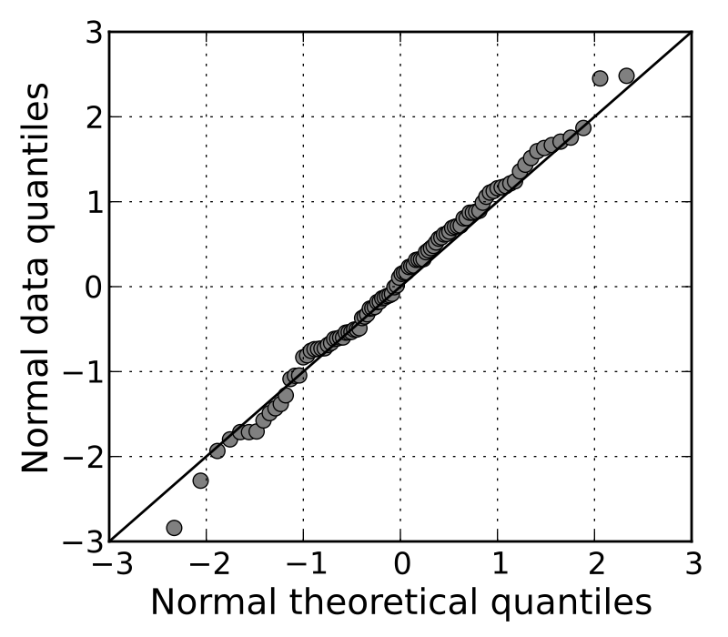

***
# I. Introduction

>  In statistics, the kth order statistic of a statistical sample is equal to its kth-smallest value.
  
  In the blog post, we want to focus on the __standard normal distribution of size 200__. Then, the median is its 100th order statistics ($X_{(100)}$), the min is the first order statistics ($X_{(1)}$), and the max will be the 200th order statistics ($X_{(200)}$).
  
***
# II. Distribution of order statistics

# A. Median

  First, we want to study the distribution of median (100th order statistics here): write the _dorder_, _poder_ and _qorder_ functions, and generate plots for each of them.
  
  Then we observe the distribution of medians from the samples and its theoretical distribution through plot of ECDF, histogram and Q-Q plot (Quantile-Quantile Plot). 

## 1. Density function: _dorder_

What is the distribution of $X_{(k)}$ (density)? 

> $f_{(k)} = k {n \choose k} [F(x)]^{k-1} [1 - F(x)]^{n-k} f(x)$

$Q_1$: Begin with the median from a sample of N = 200 from the standard normal distribution. Write an R function that is the density function for the median in this sample. Note that the 100th order statistic is approximately the median. Generate a plot of the function.

```{r}
dorder <- function(x) {
  k <- 100
  n <- 200
  k * choose(n, k) *
  (pnorm(x, 0, 1)) ^ (k - 1) *
  (1 - pnorm(x, 0, 1)) ^ (n - k) *
  dnorm(x, 0, 1)
}

curve(dorder(x), -1, 1, xlab = parse(text="X[(100)]"), ylab = "Density")
```

## 2. Probability function: _porder_

What is the distribution of $X_{(k)}$ (probability)? 

> $F_{(k)}(x) = \sum\limits_{j=k}^N {n \choose k} [F(x)]^{j} [1 - F(x)]^{n-j}$

$Q_2$: Write an R function that is the probability function for the median, 100th order statistic, in this sample. Generate a plot of the function.

```{r}
porder <- function(x){
  k <- 100
  n <- 200
  pbinom(k-1, n, pnorm(x, 0,1), lower.tail = FALSE)
}
curve(porder(x), -1, 1, xlab = parse(text="X[(100)]"), ylab = "Cumulative probability")
```

## 3. Quantile function: _qorder_
$Q_3$: Write an R function that is the quantile function for the median in this sample. Generate a plot of the function.

This is basically finding the inverse function of porder.

```{r}
qtl <- seq(0.05, 0.95, 0.05)
med_dis <- rep(NA, 19)

qorder <- function(h){
  k <- 100
  n <- 200
  for(i in seq_along(h)){
    med_dis[i] <- uniroot(function(x, p) porder(x)-p, c(-5,5), p = h[i])$root
  }
  med_dis
}

plot(qtl, qorder(qtl), type = "l", xlab = parse(text="X[(100)]"), ylab = "Quantile")
```


## 4. ECDF of median

$Q_4$: Simulate the sampling distribution for the median for __500__ times. Create a plot of the empirical CDF (ECDF). Overlay the plot of the ECDF with a plot of the CDF.

```{r}
N <- 200   # sample size = 200
M <- 5000   # number of simulations = 500
dis <- rep(NA, M)   # distribution of medians of the M times of simulation

for(i in 1: M){
  dis[i] <- median(rnorm(N))
}

ecdf <- ecdf(dis)
```

```{r}
plot(ecdf, do.points = FALSE, col = "black", lwd = 2, main = "ECDF of medians")
curve(porder(x), add = TRUE, col = "blue", lwd = 2)
legend(
  "topleft", 
  c("ECDF", "CDF"),
  lwd = 3, 
  col = c("black", "blue"), 
  bty = "n"
)
```


## 5. Histogram of median

$Q_5$: Using the simulated sampling distribution from the previous question, create a histogram (on the density scale). Overlay the histogram with a plot of the density function.

```{r}
hist(dis, breaks = 50, freq = FALSE)
curve(dorder(x), add = TRUE, col = "blue")
```

## 6. Q-Q plot of median

  Here is the explanation of Q-Q plot on wikipedia. 
  
> In statistics, a Q–Q (quantile-quantile) plot is __a graphical method for comparing two probability distributions by plotting their quantiles against each other__. If the two distributions being compared are similar, the points in the Q–Q plot will approximately lie on the line y = x. 

<center>

{width=350px}

</center>

  The x-coordinate here is the theoretical quantile while the y-coordinate is sample quantile.
  
$Q_6$: Generate a QQ plot for the simulated data of the median relative to the known sampling distribution of the median.

```{r}
random_sample <- dis   # dimension 500 = M
q_candidate <- qorder

points <- ppoints(M)

x <- qorder(points)
y <- quantile(random_sample, probs = points)

plot(x, y, asp = 1, xlab = "Theoretical quantile", ylab = "Sample quantile", main = "Q-Q plot for median")
abline(0,1)
```

  Since the most of the points lie on the y = x line, the simulated data seem to agree with the theoretical sampling distribution.
  


# B. Other order statistics (max and min)

  Previously, we focus on the distribution of median, now we study the kth order statistics for any given k.

## 1. Functions for kth order statistics (standard normal distribution)
  
$Q_7$: Modify the dorder, porder, and qorder functions so that the functions take a new parameter k (for the kth order statistic) so that the functions will work for any order statistic and not just the median.

```{r}
dorder <- function(x, k = 100) {
  n <- 200
  k * choose(n, k) *
  (pnorm(x, 0, 1)) ^ (k - 1) *
  (1 - pnorm(x, 0, 1)) ^ (n - k) *
  dnorm(x, 0, 1)
}

porder <- function(x, k = 100){
  n <- 200
  pbinom(k-1, n, pnorm(x, 0,1), lower.tail = FALSE)
}

qorder <- function(h, k = 100){
  n <- 200
  for(i in seq_along(h)){
    med_dis[i] <- uniroot(function(x, p) porder(x, k)-p, c(-5,5), p = h[i])$root
  }
  med_dis
}
```

## 2. Q-Q plot for max $X_{(200)}$

$Q_8$: Generate the QQ plot for simulated data from the sampling distribution of the sample max and the theoretical largest order statistic distribution.

```{r}
max <- rep(NA, M)   # distribution of medians of the M times of simulation

for(i in 1: M){
  max[i] <- max(rnorm(N))
}

random_sample <- max
q_candidate <- qorder

x <- qorder(points, k = N)
y <- quantile(random_sample, probs = points)

plot(x, y, asp = 1)
abline(0, 1)
```

## 3. Functions for all distributions

$Q_9$: Modify the dorder, porder, and qorder functions so that the functions take new parameters dist and ... so that the functions will work for any continuous distribution that has d and p functions defined in R.

```{r}
`%|%` <- function(a, b) paste0(a,b)

dorder <- function(x, k = 100, dist = norm, ...) {
  pf <- get("p" %|% dist)
  df <- get("d" %|% dist)
  n <- 200
  k * choose(n, k) *
  (pf(x, ...)) ^ (k - 1) *
  (1 - pf(x, ...)) ^ (n - k) *
  df(x, ...)
}

porder <- function(x, k = 100, dist = norm, ...){
  pf <- get("p" %|% dist)
  
  n <- 200
  pbinom(k-1, n, pf(x,...), lower.tail = FALSE)
}

qorder <- function(h, k = 100){
  pf <- get("p" %|% dist)
  
  n <- 200
  for(i in seq_along(h)){
    med_dis[i] <- uniroot(function(x, p) pf(x, k, ...)-p, c(-5,5), p = h[i])$root
  }
  med_dis
}
```

## 4. Distribution of min $X_{(1)}$

$Q_{10}$: Use the newly modified functions to plot the probability and density functions for the sample min (N = 200).

```{r}
curve(dorder(x, k = 1, dist = "norm"), -5, 5, xlab = parse(text="X[(1)]"), ylab = "Density")

curve(porder(x, k = 1, dist = "norm"), -5, 5, xlab = parse(text="X[(1)]"), ylab = "Cumulative probability")
```

***
# III. Conclusion and Limitations

  From the analysis, we can see that the distribution order statistics can be simulated well with binomial distribution. However, in this post, we mainly examined the order statistics of standard normal distribution. To get a more general conclusion, we need to look at more kinds of distributions.