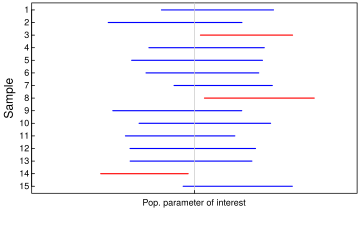

***
# I. Introduction

  For the purpose of this blog post, we study the __middle 95% confidence interval__ and define __coverage probability__ as follows:

> __Coverage probability__ is the long run proportion of intervals that capture the population parameter of interest. 

  The figure below shows the 95% confidence interval calculated for a handful of samples. Intervals in blue capture the population parameter of interest; intervals in red do not.
  
  
  
  Idealy, a 95% confidence interval will capture the population parameter of interest in 95% of samples.

***
# II. Setup

  Conceptualy, one can calculate the coverage probability with the following steps:
  
  1. generate a sample of size N from a known distribution
  
  2. construct a confidence interval
  
  3. determine if the confidence captures the population parameter
  
  4. Repeat steps (1) - (3) many times. Estimate the coverage probability as the proportion of samples for which the confidence interval captured the population parameter.
  
  In this post, we investigate the 95% confidence interval of a normal distribution with sample size N = 201.
***
# III. Calculation

Step 1: Generate a single sample from a standard normal distribution of size $N = 201$. Then generate a negative log-likelihood function (NLL, which is the function of negative log of density at each point). Then we use NLL as an input of Maximum Likely Estimation function (MLE, which essentially compute the density at each points and return the one maximizes the likelyhood). So the MLE function will tell us the estimated parameters (mean and standard deviation for normal distribution) that best estimates the underlying distribution.

```{r}
require(stats4)
# Generate sample
N <- 201
generate_data <- function(N){
  s <- rnorm(N, mean = 0, sd = 1)
  
  # estimate distribution with MLE
  nLL <- function(mean, sd){
    fs <- dnorm(x = s, mean = mean, sd = sd, log = TRUE)
    -sum(fs)
  }
  
  fit <- mle(nLL, start = list(mean = 1, sd = 0), method = "L-BFGS-B", lower = c(0, 0.01))
  
  coef(fit)
}
```

Step 2: Approximate the sampling distribution of the median, conditional on the estimate of the distribution in the previous step. Given the estimated parameters (mean and standard deviation) from step 1, generate samples 5000 times and calculate the median for each sample. 

```{r}
# Approximate the sampling distribution of median
generate_distribution <- function(coef, R = 5000){
  out <- rep(NA, R)
  for(i in 1:R){
    b <- rnorm(N, mean = coef[1], sd = coef[2])
    out[i] <- median(b)
  }
  out
}
```

Step 3: Calculate a 95% confidence interval from the approximated sampling distribution. Given the sample data from step 2, we generate a 95% confidence interval by using the quantile function to capture the middle 95% data.

```{r}
alpha <- 0.05
generate_ci <- function(data, alpha = 0.05){
  quantile(data, c(alpha/2, 1 - alpha/2))
}
```

Step 4: Examine the definition of coverage probability in part I. Here, for each confidence interval generated from samples, we check if it covers the underlying true value. Then we calculate the percentage of if successfully covering the null value, and get our coverage probability.

```{r}
capture_median <- function(ci){
  1*(ci[[1]] < 0 & 0 < ci[[2]])
}
```

Step 5: Perform the simulation and report the results.

```{r, cache=TRUE}
M <- 10000
captures <- rep(NA, M)

require(foreach)
require(doParallel)

cores_2_use <- detectCores(TRUE) -1
cl <- makeCluster(cores_2_use)
clusterSetRNGStream(cl, 2344)
registerDoParallel(cl)

captures <-  foreach(i = 1:M, .combine = c, .packages = c('dplyr', 'stats4')) %dopar% {
  captures[i] <- generate_data(201) %>% generate_distribution %>% generate_ci %>% capture_median
}

stopCluster(cl)

mean(captures)
```

***
# III. Analysis

  How to change the simulation so that we learn more about the operating characteristics of the chosen method for constructing the 95% confidence interval?
  
  In this post, we estimated the parameters of our distribution in step 1, then we used the same parameters to generate distributions. However, to capture more uncertainties, for each sample, we can generate the parameters specifically for that random sample, and then generate the distribution.
  
  